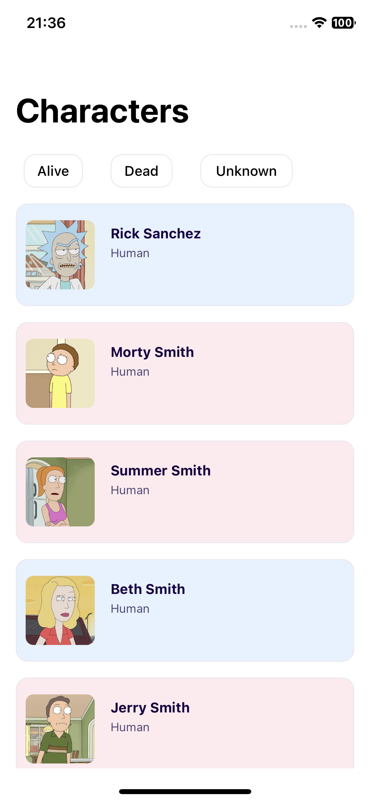
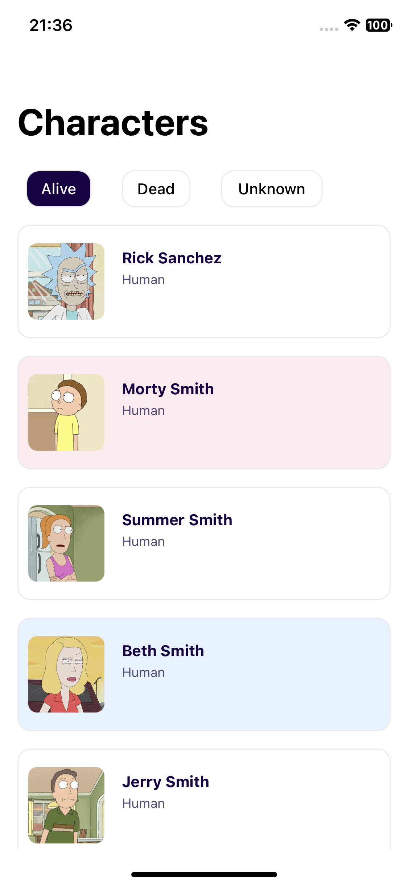
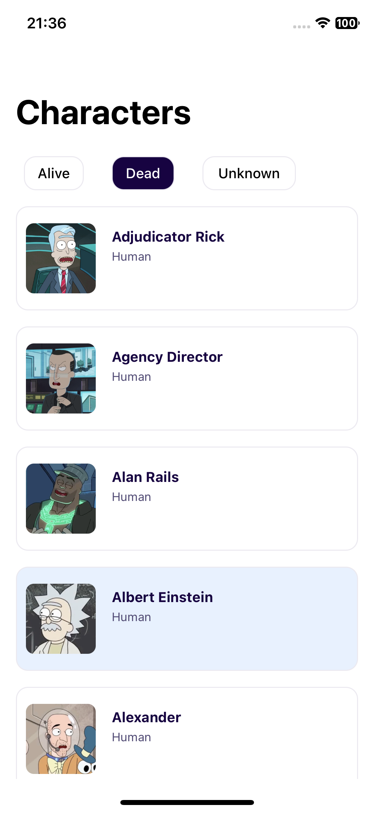
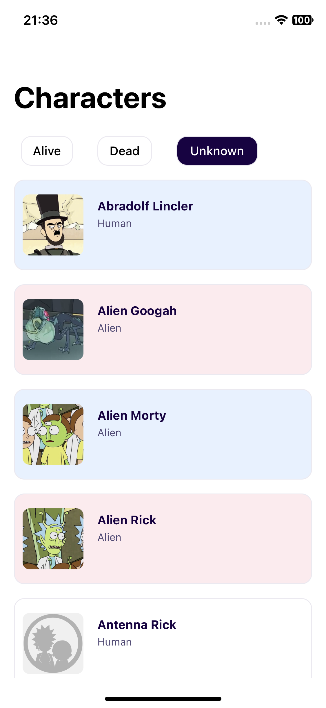

# Rick and Morty Characters App

This iOS application allows users to explore and filter characters from the popular TV show "Rick and Morty" using data from the [Rick and Morty API](https://rickandmortyapi.com/). The app features character listings with filters for their status (Alive, Dead, Unknown), and uses the Kingfisher library for efficient image loading.

## Features

- **Character Listing**: Browse through a list of characters from the Rick and Morty universe.
- **Status Filters**: Filter characters by their status—Alive, Dead, or Unknown.
- **Image Caching**: Efficient image loading and caching using the Kingfisher library.
- **Pagination**: Seamlessly load more characters as you scroll through the list.

## Screenshots

| All Characters | Filtered: Alive | Filtered: Dead | Filtered: Unknown |
|----------------|-----------------|----------------|-------------------|
|  |  |  |  |

## Demo Video

Here's a short video demonstrating the app's functionality:


## Installation

1. Clone this repository:
   ```bash
   git clone https://github.com/Andrewananda/RickAndMotryApi.git
```
2. Cd to where you have cloned the project
```bash
   cd RickAndMotryApi
```
3. Run project
```bash 
   open RickAndMotryApi.xcworkspace
```

